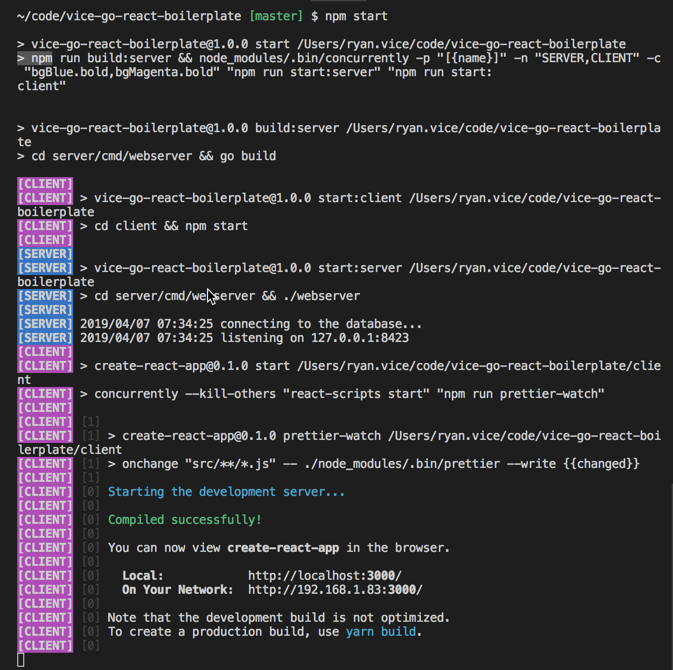

# Vice Go React Boilerplate

Provides an opinionated starting point for apps built on React and Go stack

- [Vice Go React Boilerplate](#vice-go-react-boilerplate)
- [Getting Started](#getting-started)
- [Documentation](#documentation)
- [Tech Stack](#tech-stack)
  - [Dependencies](#dependencies)

# Getting Started

To run this boilerplate

1. See [/server/readme.md](server/readme.md) and follow the instructions in the "Getting started section". **Make sure you have properly setup the database and that you have postgres running** as described there.
2. Execute `npm run preinstall` to install the client dependencies. Doing this will simply run `/client> npm install` for you.
3. Execute `npm start`. Doing this will execute `npm run start:client` and `npm run start:server` along with some color coding so that you will have a nice output for both client and server in the same terminal window as shown below.

4. You should get a browser open to http://localhost:3000 with the client app running in it and to verify that the server is running open http://localhost:8423/swagger/index.html to see the servers swagger documentation page.

# Documentation

The documentation for the server and client can be found in their associated readme files shown below.

- [Client Documentation](client/readme.md)
- [Server Documentation](server/readme.md)

# Tech Stack

The stack this boilerplate is built on is shown below

- React
  - Redux
  - React Router
  - Redux Forms
- Go
  - Gorrilla
  - GORM
- Postgres

## Dependencies

This boilerplate is a combination of the following boilerplates which have been copied to the folders shown below

- /client
  - [Vice React Boilerplate](https://github.com/RyanAtViceSoftware/vice-react-boilerplate)
- /server
  - [Vice Go Boilerplate](https://github.com/vicesoftware/vice-go-boilerplate)
